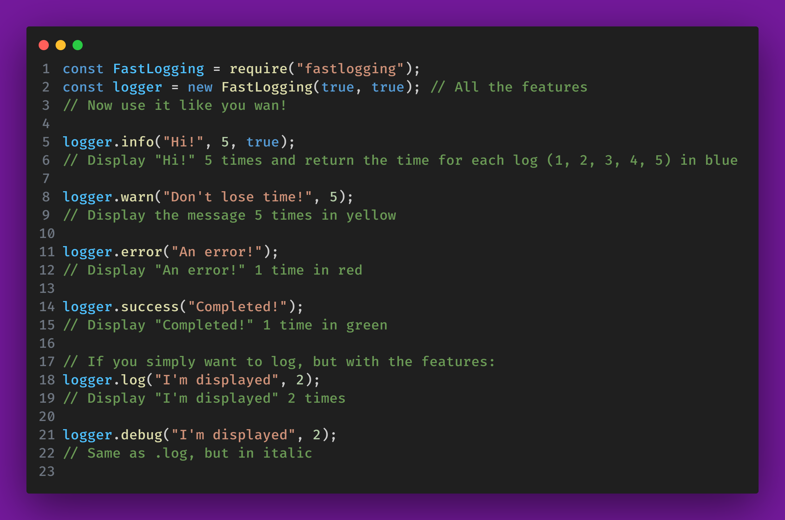
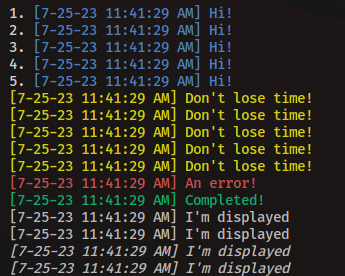

# FastLogging ⚡

[](https://www.npmjs.org/package/fastlogging)

FastLogger is, like its name, a new way to log your messages more easier and faster. Here is how to use it

## Usage

Install it first:

```
 npm i fastlogging
```

<br>
Then put it in your project, he has two parameters

<code>timestamp: boolean default = false,</code><br>
<code>completeTimestamp: boolean default = false</code> (timestamp is if the hour should be displayed, and completeTimestamp just add the date):
<br>



### Outputs examples:



## Contribute

Go on our <a href="https://github.com/AYnonyme971/FastLogger">GitHub</a> and make a pull request!
<br>Have a problem? Create an <a href="https://github.com/AYnonyme971/FastLogger/issues">issue</a> on GitHub
<br>An idea? DM <a href="https://discord.com/users/">me</a> on Discord!
